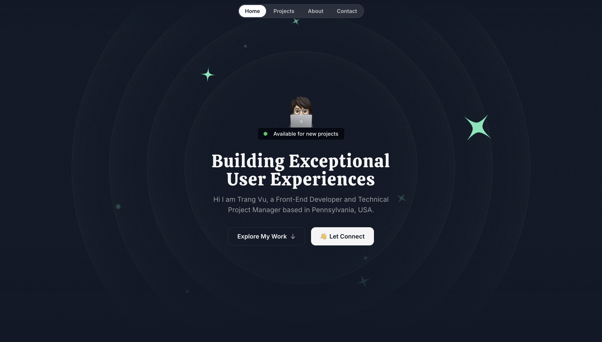
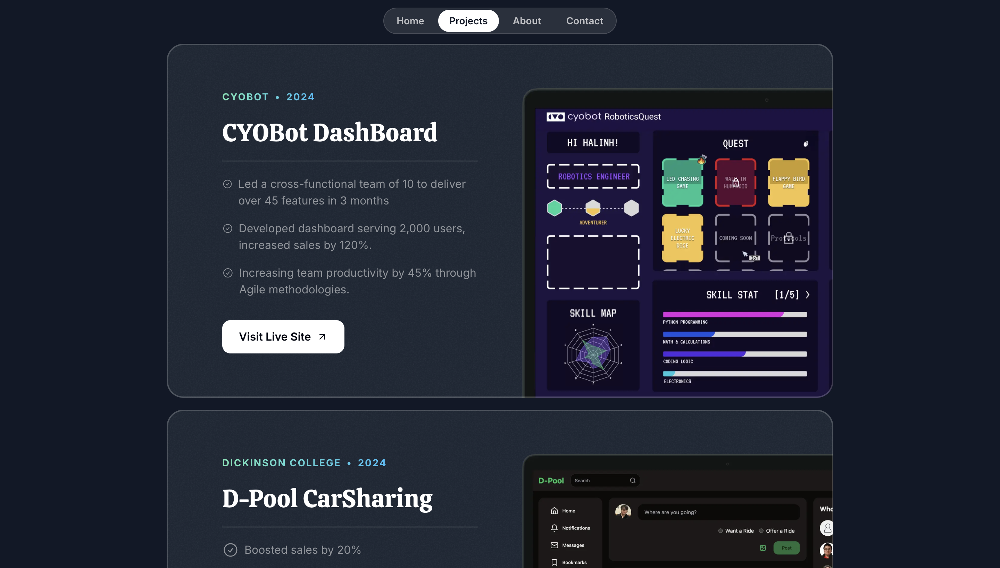
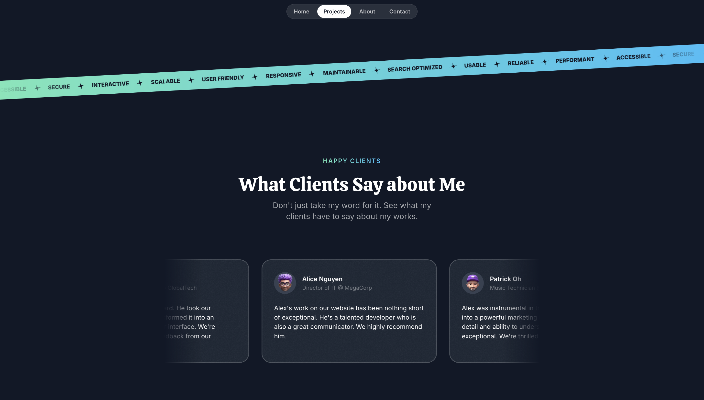
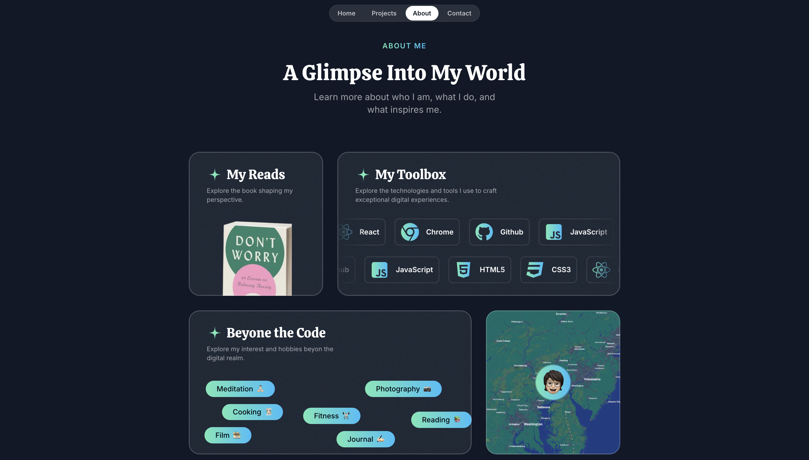

# My Portfolio Website

Welcome to my portfolio website repository! This project showcases the power of **React**, **Next.js**, **TailwindCSS**, and **Framer Motion**, all tied together in an end-to-end project. You'll learn the foundations of these technologies and how to use them to build a dynamic, high-performance, and visually captivating web application.

---

## Key Features

### 1. React & Next.js Foundations
- Understand the core concepts of React and Next.js.
- Build a robust and high-performance web application.

### 2. TailwindCSS Mastery
- Style the portfolio effortlessly with Tailwind's utility-first approach.
- Achieve responsive, scalable designs with minimal CSS code.

### 3. Framer Motion & CSS Animations
- Create stunning animations and micro-interactions.
- Enhance user engagement with smooth transitions and interactive elements.

### 4. End-to-End Project Build
- Follow the process of building the portfolio from scratch.
- Learn best practices for setting up, styling, and deploying a complete website.

---

## Project Demo

Here are some screenshots from the project:

### Home Page


### Projects Section


### Testimonial Section


### About Me Section


---

## Technologies Used

### Frontend Frameworks:
- **React**: Component-based architecture for building dynamic UIs.
- **Next.js**: Server-side rendering and optimized routing for performance.

### Styling:
- **TailwindCSS**: Utility-first CSS framework for efficient styling.
- **CSS Animations**: Adds subtle enhancements to improve aesthetics.

### Animations:
- **Framer Motion**: Library for powerful and declarative animations.

---

## Getting Started

### Prerequisites
Ensure you have the following installed:
- [Node.js](https://nodejs.org/)
- [npm](https://www.npmjs.com/)

### Installation

1. Clone the repository:
   ```bash
   git clone https://github.com/your-username/your-portfolio.git
   ```

2. Navigate to the project directory:
   ```bash
   cd Folder
   ```

3. Install dependencies:
   ```bash
   npm install
   ```

### Running the Development Server

Start the development server: `npm run dev`

Open [http://localhost:3000](http://localhost:3000) to view your portfolio in the browser.

---

## Deployment

To deploy your portfolio, you can use platforms like [Vercel](https://vercel.com/) which supports Next.js and make deployment seamless.

### Steps for Vercel Deployment
1. Connect your GitHub repository to Vercel.
2. Select the branch to deploy.
3. Vercel will automatically build and deploy your site.

---

## Contributing

Feel free to fork the repository and submit pull requests for improvements or new features. Your contributions are welcome!

---

## License

This project is open-source and available under the [MIT License](LICENSE).

---

## Contact

Have questions or want to connect?
- **Email**: vuthutrang801@gmail.com
- **LinkedIn**: [Trang Vu](https://linkedin.com/in/trang-vu-4126b123b/)

